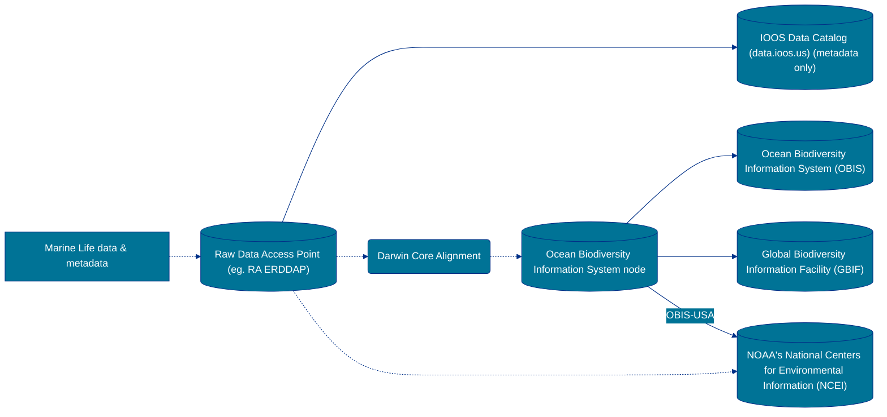
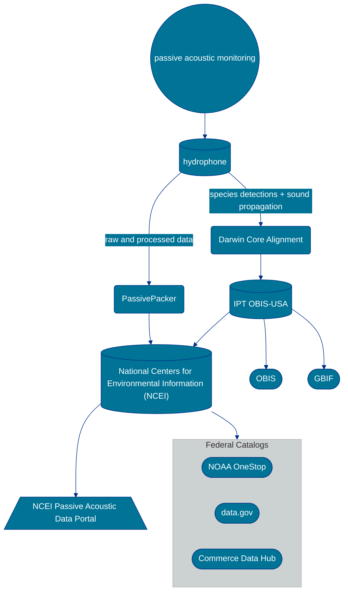
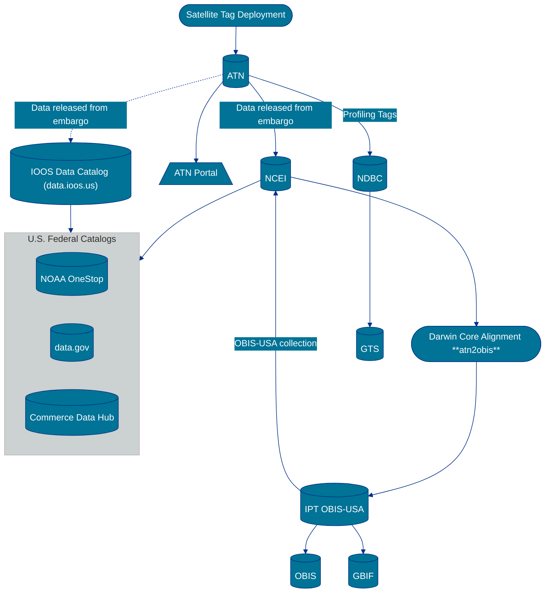
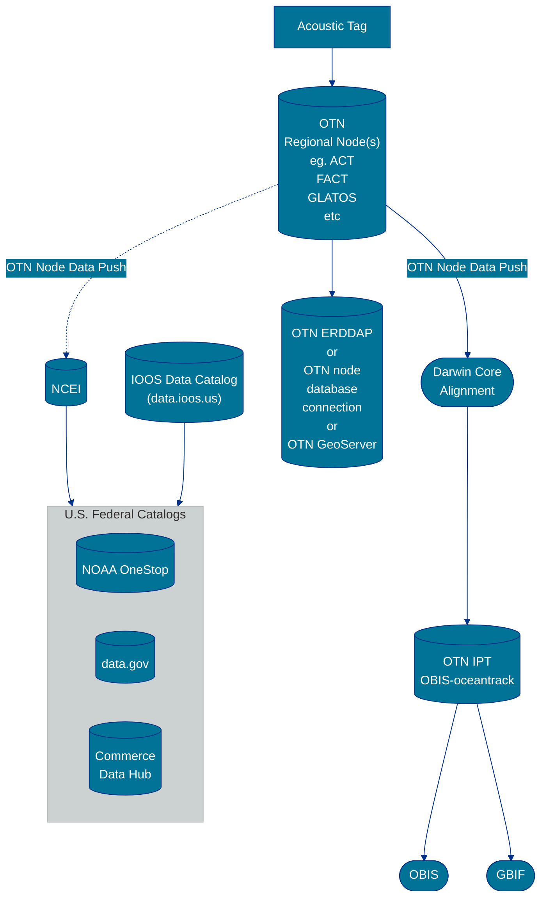
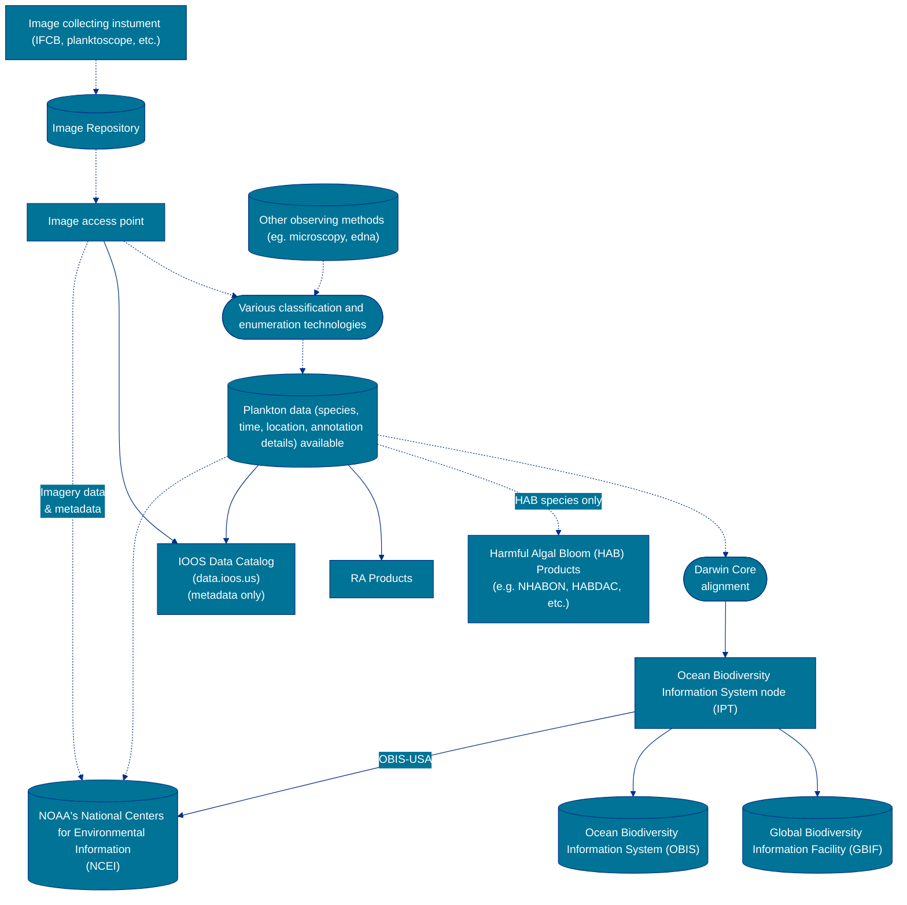

How to cite:

```
Biddle, M., Brenskelle, L., & Canonico, G. (2025). Marine Life Data Network Recommendations (v1.0.1). Zenodo. https://doi.org/10.5281/zenodo.15304225
```

[](https://doi.org/10.5281/zenodo.15304225)


## Contribute to Marine Life Data Network Recommendations

All of the content for this website is managed through Markdown documents found in the respective [GitHub repository](https://github.com/ioos/marine_life_data_network/tree/gh-pages). If you would like to contribute to this documentation, use the `Edit me` button above to suggest changes. If you would like to raise concerns about the guidance, or need clarification, please create an appropriate [issue](https://github.com/ioos/marine_life_data_network/issues/new). For more guidance on contributing to these recommendations, see our [CONTRIBUTING](https://github.com/ioos/marine_life_data_network/blob/gh-pages/CONTRIBUTING.md) guide.

## Introduction

The vision of the U.S. IOOS Office [Marine Life Program](https://ioos.noaa.gov/ioos-in-action/marine-life/) is to provide access to marine life observations, data and information products for management, forecasting and decision-making towards resilience and stability of living marine resources and human communities in the face of change. The IOOS Marine Life Data Network (MLDN) aims to meet the needs identified by the broader marine life observing community for access to and tools for integration and analysis of national and regional data and co-developed data visualization and information products. In the context of this data network, marine life observations and data are defined as **any observations of life across multiple trophic levels (from plankton to whales and including habitat-formers such as corals, seagrasses, macroalgae, etc.) in aquatic (ocean, coast, and Great Lakes) environments.** This includes any data that identify living organisms, document abundances and distributions, describe lifecycles, explore functional interactions, and document the impacts of environmental change on organisms and their communities.

The Marine Life Data Network will support the Program by connecting partners and users to tools and institutions that deliver marine life data and information from local to global scales. The MLDN will focus on the following goals: 
- Expand IOOS Enterprise marine life data management and cyberinfrastructure capabilities.
- Support the development of user-driven products and tools.
- Promote common data standards, formats, and data services for marine life.
- Coordinate a multi-disciplinary data management community of practice to advance Open Science, Open Data, and Open Software.

The Marine Life Data Network builds on the successes of the [U.S. Marine Biodiversity Observation Network (MBON)](https://marinebon.org/us-mbon/), [U.S. Animal Telemetry Network (ATN)](https://atn.ioos.us/), the [National Harmful Algal Bloom Observing Network (NHABON)](https://ioosassociation.org/nhabon/), and other marine life related efforts led by the IOOS Regional Associations. IOOS Regional Associations and other partners use a range of marine life observing methods including acoustic and satellite telemetry, still and video imagery, active and passive acoustics, remote sensing, eDNA, traditional survey methods, and automated sampling. As opposed to a central repository or data assembly center, the MLDN is a network of IOOS-recommended repositories, standards, tools, and products that make up the marine life data ecosystem and support the ocean observing system objectives of IOOS.

This website describes the recommendations for formatting and sharing data and metadata for the MLDN community. The materials presented here were developed through the MBON Data Management and Cyberinfrastructure Working Group (MBON DMAC WG). The working group charter can be found [here]({{ site.url }}/mbon-docs/working-group-charter.html). 

## Categories of Marine Life observations

At its most simplistic state, observations of a **species at a place (latitude and longitude) and time** can be standardized to [Darwin Core](https://dwc.tdwg.org/) and shared to the [Ocean Biodiversity Information System (OBIS)](https://obis.org/) and/or the [Global Biodiversity Information Facility (GBIF)](https://www.gbif.org/). 
The Marine Life Data Network recommends following that pathway regardless of the observing method by which the data were collected. 
For more information about aligning data to Darwin Core, see the [Marine Biological Data Mobilization Workshop resources](https://ioos.github.io/bio_mobilization_workshop/).

In some cases, there are additional pathways an observing method's data may take. Below is a short list of the various observing platforms and data management leading practices for those data types. 
Some are still in development and we encourage conversations on the topics by contributing [issues](https://github.com/ioos/marine_life_data_network/issues/new) to this repository.

### &#128031; Species observation (high level data pathway)



  - See the [MLDN data flow](https://ioos.github.io/marine_life_data_network/data-flow.html) for sharing and standardizing any data that observes a species at a location and time to Darwin Core. 

### &#129516; Genetic make-up (‘Omics, eDNA)


  - See the [NOAA Omics Data Management Guide](https://noaa-omics-dmg.readthedocs.io/en/latest/) as the authoritative source for proper data management.
  - For lab protocols, see the [NOAA Omics Technical Portal](https://noaa-omics-technical-portal.readthedocs.io/en/latest/).
  - See the [FAIR eDNA](https://fair-edna.github.io/index.html) metadata checklist, which integrates existing data standards and introduces new terms tailored to eDNA workflows.

### &#127908; Passive Acoustic Monitoring (PAM)



  - See [NCEI's Passive Acoustic Data Best Practices](https://www.ncei.noaa.gov/products/passive-acoustic-data#tab-3561) as the authoritative source for proper data management.

### &#128752; Satellite telemetry



  - See [Integrated Ocean Observing System (IOOS) Animal Telemetry Network Data Assembly Center (ATN DAC)](https://atn.ioos.us/help/).
  - See [atn2obis](https://github.com/MathewBiddle/atn2obis): A package to submit summarized ATN satellite telemetry data from NCEI to OBIS-USA Integrated Publishing Toolkit

### &#128266; Acoustic telemetry



  - Work with the appropriate [Ocean Tracking Network](https://oceantrackingnetwork.org/) Node in your region. Below is a non-comprehensive list of the nodes which IOOS Regional Associations can work with:
  
    | Node | Region | Web Address
    |------|--------|------------
    | FACT | Southeast US | <https://secoora.org/fact/>
    | ACT | Mid-Atlantic to Northeast US | <https://www.theactnetwork.com/>
    | iTAG | Gulf of Mexico | <https://myfwc.com/research/saltwater/telemetry/itag/>
    | PIRAT | Pacific Islands | <https://piratnetwork.org/>
    | GLATOS | Great Lakes | <https://glatos.glos.us/>
    | N-PAcT | Northeast Pacific | <https://npact.aoos.org/> 


### &#128248; Plankton (Image-Based and Non)
  - Imaging Flow CytoBot (IFCB) - [Prototype workflow](https://github.com/CeNCOOS/OBIS_workshop_2024_IFCB) from CeNCOOS to generate a Darwin Core archive.



## Website contents
- [Data Flow]({{ site.url }}/marine_life_data_network/data-flow.html) - This is a summary of the Marine Life Data Network (MLDN) data flow.
- [Data and File Formatting]({{ site.url }}/marine_life_data_network/data.html) - This is MLDN data recommendations.
- [Metadata and Documentation]({{ site.url }}/marine_life_data_network/metadata.html) - This is the MLDN metadata recommendations.
- [How to guide for MLDN Metadata]({{ site.url }}/marine_life_data_network/metadata-eml.html) - This is a how-to guide for collecting MLDN metadata.
