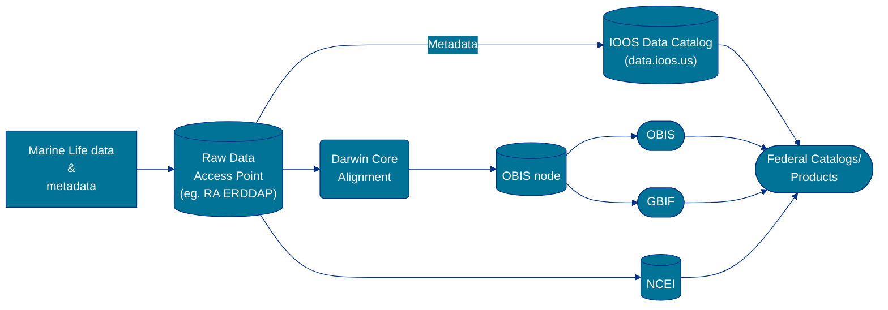

# MLDN Data Flow

For data collected/managed by an IOOS MBON project, the project should ensure data and information are readily available
to resource managers, scientists, educators, and the public in an easily digestible way. To that end, coordination with
an IOOS Regional Association to make the data available via ERDDAP services meets these goals. Using the services that
ERDDAP provides, a data manager can develop a reproducible workflow for aligning the data to the
[Darwin Core standard](https://dwc.tdwg.org/). Finally, submission to NCEI ensures that no observations are lost and
there is long-term stewardship of these data, as well as meeting our PARR requirements. The sections below provide more
context as well as tips and tricks for each of the elements in the diagram above.

## For MBON Projects
Datasets should be registered in the [MBON dataset registration form](https://docs.google.com/forms/d/e/1FAIpQLSfguACbLmcLiFxHKsR5W5Mv9nEfd0E8oX2rY78gdwAYTrq_zA/viewform?usp=sf_link). This will ensure that we (the IOOS Marine Life DMAC team) are aware of the dataset and can track its progress through the data management and sharing workflows. 

## RA ERDDAP
For the IOOS MBON projects ERDDAP is used as a mechanism for quickly and efficiently sharing biological observations with
the broader community. While ERDDAP can provide data access following the FAIR principles, further alignment to Darwin
Core and submission to OBIS is necessary to make these observations more useful to a broader audience. Essentially, serving
data through an RA ERDDAP is one part of a larger process and should be treated as such.

### Key principles for data
When preparing a dataset to be served via ERDDAP it is recommended to follow a few key principles for data management.
* For organizing your data files, follow the [Tidy data](https://r4ds.had.co.nz/tidy-data.html) recommendations:
  * Variables as columns
  * Observations as rows
  * Don't embed data in the column headers.
* Follow [ISO-8601](https://en.wikipedia.org/wiki/ISO_8601) for dates
  * `YYYY-MM-DDTHH:mm:ssZ` (eg. 2021-08-19T12:38:22Z)
  * Include the time zone.
* Latitude and Longitude in decimal degrees (WGS84 preferred)
* Identify units of measure
* Check species names against [WoRMS](https://www.marinespecies.org/).
* See the sections on [Data and File Formatting](data.html) and
[Metadata and Documentation](metadata.html) for more recommendations and best practices.

**Additional Resources**
* [Configuring datasets.xml](https://coastwatch.pfeg.noaa.gov/erddap/download/setupDatasetsXml.html) - The ERDDAP manual
for configuring a dataset.
* [ERDDAP Quick Start Guide](https://ioos.github.io/erddap-gold-standard/) - Quick Start Guide for deploying ERDDAP in a Docker Container.
* [ERDDAP Google Group](https://groups.google.com/g/erddap) - A great place to search for questions and ask your
questions.

### ERDDAP Requirements

Below is a list of the absolute bare minimum pieces of metadata required by ERDDAP. Some dataset types might have other
requirements specific to the data file formats.
* Global attributes
  * [datasetID](https://coastwatch.pfeg.noaa.gov/erddap/download/setupDatasetsXml.html#datasetID)
  * [sourceUrl](https://coastwatch.pfeg.noaa.gov/erddap/download/setupDatasetsXml.html#sourceUrl) - however, depends on
dataset type
  * [infoUrl](https://coastwatch.pfeg.noaa.gov/erddap/download/setupDatasetsXml.html#infoUrl)
  * [institution](https://coastwatch.pfeg.noaa.gov/erddap/download/setupDatasetsXml.html#institution)
  * [summary](https://coastwatch.pfeg.noaa.gov/erddap/download/setupDatasetsXml.html#summary)
  * [title](https://coastwatch.pfeg.noaa.gov/erddap/download/setupDatasetsXml.html#title)
* Variable attributes
  * [dataVariable](https://coastwatch.pfeg.noaa.gov/erddap/download/setupDatasetsXml.html#dataVariable)
  * [sourceName](https://coastwatch.pfeg.noaa.gov/erddap/download/setupDatasetsXml.html#sourceName)

### ERDDAP Tips and Tricks
* Date/time - It is not a requirement to have a variable assigned to `time`  (ie.
`<destinationName>time</destinationName>`) in ERDDAP. If a variable's destinationName is set to `time`, ERDDAP will use
the `units` attribute to attempt to interpret the datum. See the documentation on [How ERDDAP Deals with
Time](https://coastwatch.pfeg.noaa.gov/erddap/convert/time.html#erddap) for more information.
  * *Trick* - If you don't want the variable interpreted as a time, set the `<destinationName>` to something other than
`time`. For example, in your source file the coumn `time` has a value of `2020-01-01`, but you don't want that
interpreted by ERDDAP. Then, set the `destinationName` to `time2` and ERDDAP will treat the field as a string.
  * *Caution* - If you do not have an assigned `time` variable in a dataset, some of the access formats might not be
available (eg. .esricsv, .odvtxt).
* Latitude/Longitude - Similar to date/time above, it is not a requirement to have latitude/longitude variables. However,
the dataset will have a limited amount of access formats.
* *Trick* - ERDDAP now has the capability to create derived variables from existing fields (since v2.10). See the
documentation on [Script SourceNames / Derrived
Variables](https://coastwatch.pfeg.noaa.gov/erddap/download/setupDatasetsXml.html#scriptSourceNames).
* *Trick* - ERDDAP can handle media files, such as image, audio and video files. See
[MediaFiles](https://coastwatch.pfeg.noaa.gov/erddap/download/setupDatasetsXml.html#MediaFiles) for more information.
   * *Bonus Trick* -
[EDDTableFromFileNames](https://coastwatch.pfeg.noaa.gov/erddap/download/setupDatasetsXml.html#MediaFiles) allows you to
create a dataset from information about files in the file system. While it doesn't serve data from within the files it
does provide a mechanism for sharing data in other formats (eg. zip packages, Word docs, Excel spreadsheets, etc.). The
resultant dataset in ERDDAP is composed of the following columns: `url`, `name`, `lastModified`, and `size`.

## Darwin Core alignment
When aligning a dataset to Darwin Core it is recommended that a data manager starts with serving the data via ERDDAP
or some comparable online system which has an [API](https://en.wikipedia.org/wiki/API) (or a way to programmatically
grab the data). When working through the Darwin Core alignment using a scripting language (eg. R or Python) which uses
the data served via ERDDAP (or comparable service) is highly recommended. A scripting language provides provenance,
transparency, and reproducibility for the translation. This helps reduce the amount of errors and back-and-forth between
data managers and OBIS. It is highly recommended that, if using a scripting language, the scripts are shared via
distributed version control systems like [GitHub](https://www.github.com).

**Recommendations TL;DR;**
* Follow the guidance at [TDWG's Darwin Core quire reference guide](https://dwc.tdwg.org/terms/).
* Use a scripting language.
* Script should point to source data on a hosted web service.
* Scripts should be shared via GitHub.

**Additional Resources**
* [Standardizing Marine Biological Data Guide](https://ioos.github.io/bio_data_guide/) - A guide and examples of 
aligning datasets to Darwin Core.
* [Aligning data to Darwin Core notebook in IOOS CodeLab](https://ioos.github.io/ioos_code_lab/content/code_gallery/data_management_notebooks/2020-12-08-DataToDwC.html) - A Python notebook for aligning a dataset to Darwin Core available in the IOOS Code Lab.
* [OBIS Manual](https://manual.obis.org/) - This manual provides an overview on how to contribute data to OBIS and how to acess data from OBIS

## Sending to OBIS-USA
Below are the various options for sending your data to OBIS-USA.

* Attend the monthly [Standardizing Marine Biological Data Working Group](https://github.com/ioos/bio_data_guide#monthly-meetings) meeting and discuss transfer options.
* Contribute your dataset (and code) to the `datasets/` directory in the ioos/bio_data_guide repository ([here](https://github.com/ioos/bio_data_guide/tree/main/datasets)). See the [Contribute example applications](https://github.com/ioos/bio_data_guide/blob/main/CONTRIBUTING.md#contribute-example-applications) documentation for more information.
* Email Darwin Core aligned files to OBIS-USA: <obis-usa@usgs.gov>.
* Or, use the [Dataset Review Request](https://github.com/ioos/bio_data_guide/issues/new/choose) issue to initialize the request.

## Sending to NCEI
When planning on submitting data to NCEI, the data provider should coordinate submissions through the IOOS Office to 
identify which submission system should be used. This will ensure that the dataset is appropriately identified, tracked,
and stewarded through the submission process.

Ideally, the raw data should be archived at NCEI. Typically, this will be the dataset served through 
the [IOOS RA ERDDAP](#ra-erddap) and following the [key principles](#key-principles-for-data) laid out above. Archiving the dataset in its more raw
form (vs the Darwin Core aligned form) ensures that no information is lost. This also ensures that data providers 
can always go back to the source data if issues arise. 

For more information about archiving data at NCEI, see [https://www.ncei.noaa.gov/archive](https://www.ncei.noaa.gov/archive).

Briefly, the submission package sent to NCEI should indicate that the observations are from an IOOS MBON project (or 
has some affiliation with IOOS). Below is a short summary of the two submission systems at NCEI and their intended uses.
* [ATRAC](https://www.ncdc.noaa.gov/atrac/guidelines.html) - Use the Advanced Tracking and Resource Tool for Archive
Collections (ATRAC) to submit repeating or multiple delivery data, or data that exceeds 20 GB.
* [S2N](https://www.ncei.noaa.gov/archive/send2ncei/) - Use Send2NCEI to submit non-repeating or single delivery data less than 20 GB.

**Note:** NCEI and OBIS-USA have established an automated process to archive the datasets from the OBIS-USA IPT. The process archives
the Darwin Core Archive version of the dataset and updates the NCEI Archival Information Package found at <https://www.ncei.noaa.gov/access/metadata/landing-page/bin/iso?id=gov.noaa.nodc:0250940>. While the OBIS-IPT is an extremely valuable product, the raw data should be 
archived at NCEI as well.
